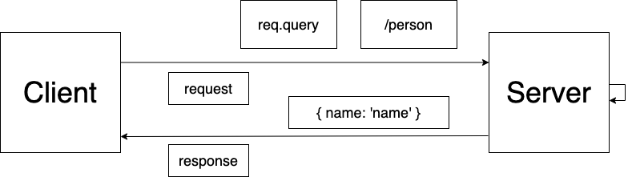

# LAB - Class 02

## Project: Basic Express Server

### Author: Nathan Cox

### Links and Resources

- [CI/CD](https://github.com/401-advanced-javascript-nathanRcox/basic-express-server/actions)
<!-- - [Back-end Server URL](http://xyz.com) (when applicable) -->
- [Front-end Application](https://nrc-basic-express-server.herokuapp.com/) (when applicable)

### Setup

#### `.env` requirements (where applicable)

- `PORT` - 3000
<!-- - `MONGODB_URI` - URL to the running mongo instance/db -->

#### How to initialize/run your application (where applicable)

- e.g. `npm start`

#### How to use your library (where applicable)

#### Tests

- How do you run tests?: with my fingers crossed; also, npm test.
- Any tests of note?: the test of time.
- Describe any tests that you did not complete, skipped, etc: none.

#### UML

